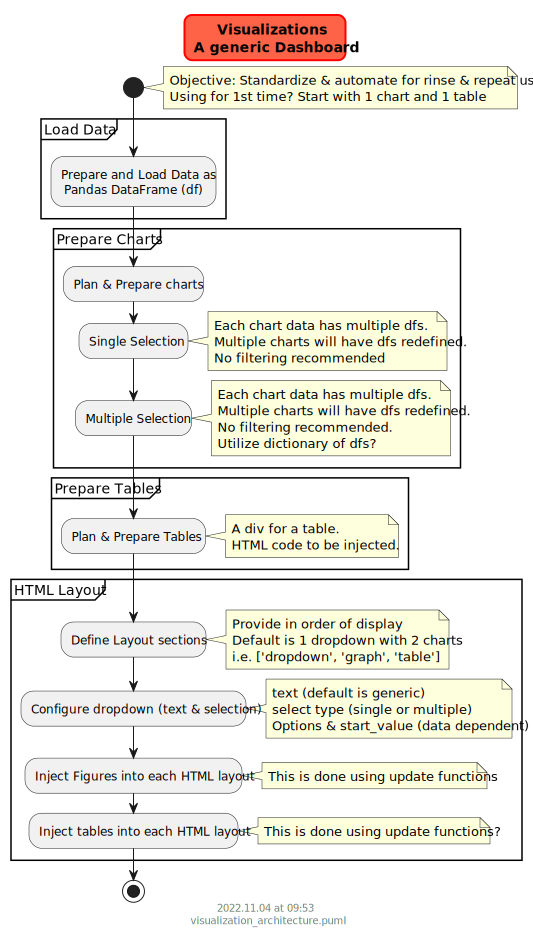

# Introduction

Data science typically involves data, analysis, tests and outputs. A simple way to review, verify or present results is via Visualizations.

Plotly Dash is selected to help prepare and present visualizations in a single dashboard.

# Summary

A library is being under development to standardize this. See [dashhtmlgrid](https://github.com/vamseeachanta/dashhtmlgrid)

**#TODO**

# Usage

- Prepare data
- Define html div matrix using app layout (based on expected outputs). Some examples are:
    - 
- Utilize standard elements to plug into each matrix divs charts, tables 

## Example codes

- Dropdown - Single selection. Example is given below:
    - https://github.com/vamseeachanta/energy/blob/ea3d37d9c65175cb6718d3052948d1871b3e54e2/py/utilities/plotly_dash_dropdown_graph.py
- Dropdown - Multiple selection. Example is given below:
    - https://github.com/vamseeachanta/energy/blob/ea3d37d9c65175cb6718d3052948d1871b3e54e2/py/utilities/plotly_dash_dashboard1.py

## Drag value - Circular Callback

https://community.plotly.com/t/dash-1-19-0-circular-callbacks-drag-value-in-dcc-slider-close-button-in-dev-tools-dcc-graph-bug-fixes/49500

## CSS templates

https://towardsdatascience.com/how-to-embed-bootstrap-css-js-in-your-python-dash-app-8d95fc9e599e

## References

https://pypi.org/project/dash/
https://www.statworx.com/en/content-hub/blog/how-to-build-a-dashboard-in-python-plotly-dash-step-by-step-tutorial/
https://chart-studio.plotly.com/dashboard/PythonPlotBot:540/present#/

20 line code dashboard tutorial
- https://pythoninoffice.com/python-dash-web-app-tutorial/
- https://youtu.be/fhJ_6EbawUA
